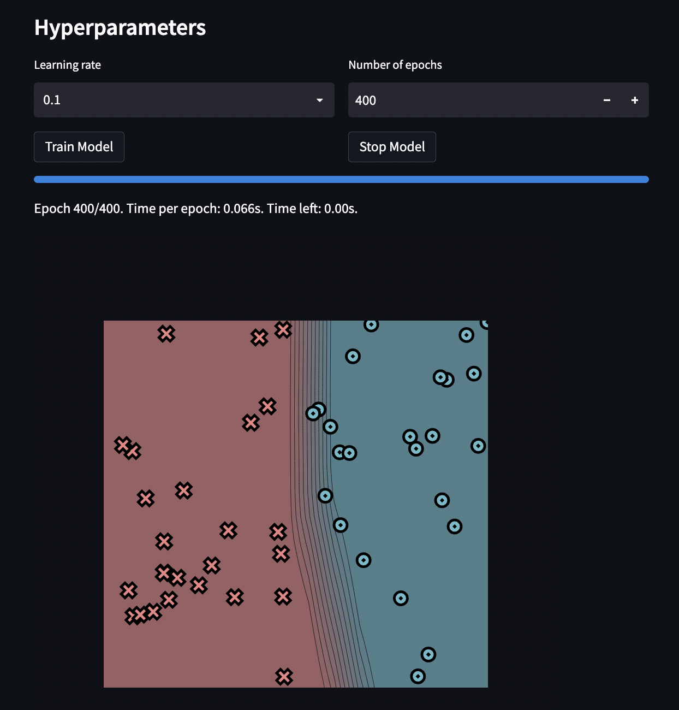
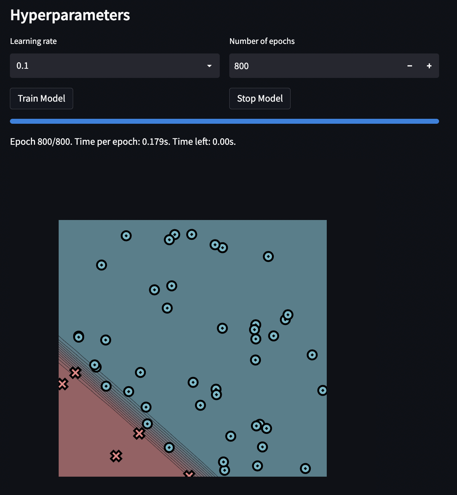
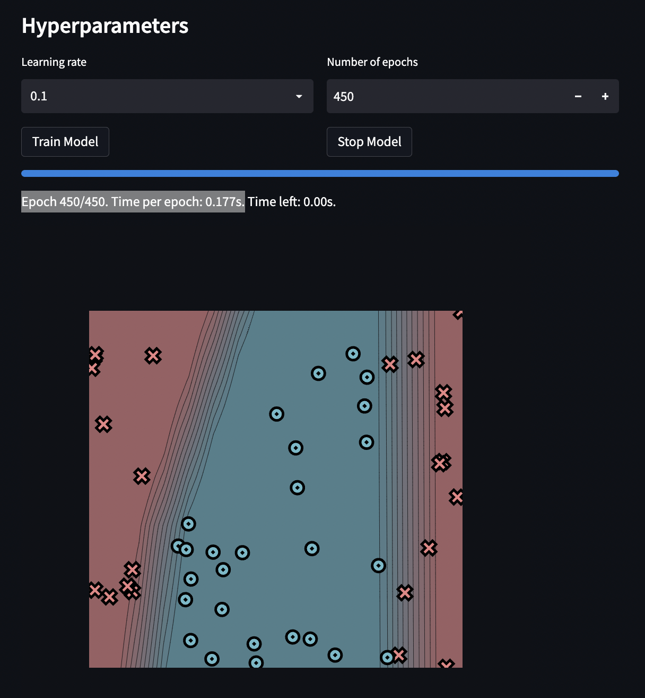
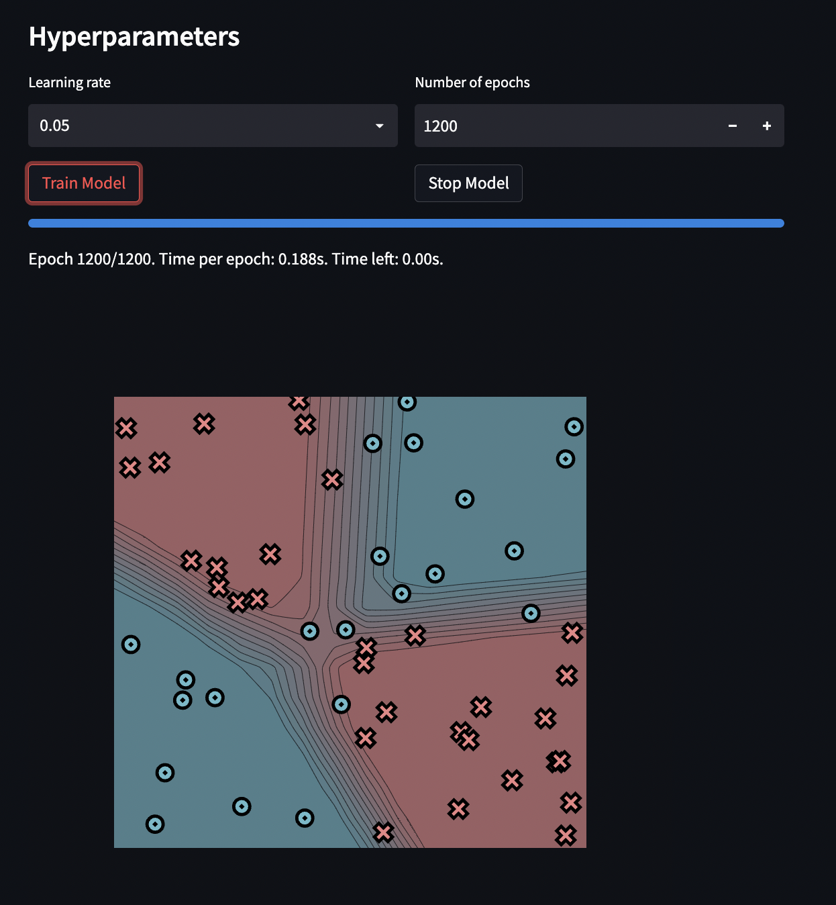

[](https://classroom.github.com/a/YFgwt0yY)
# MiniTorch Module 2


* Docs: https://minitorch.github.io/

* Overview: https://minitorch.github.io/module2/module2/

This assignment requires the following files from the previous assignments. You can get these by running

```bash
python sync_previous_module.py previous-module-dir current-module-dir
```

The files that will be synced are:

        minitorch/operators.py minitorch/module.py minitorch/autodiff.py minitorch/scalar.py minitorch/scalar_functions.py minitorch/module.py project/run_manual.py project/run_scalar.py project/datasets.py


## Simple Dataset
Size of hidden layer: 4 \
Epoch 400/400. Time per epoch: 0.066s. \
 \
Epoch: 0/400, loss: 0, correct: 0
Epoch: 10/400, loss: 33.57299730389755, correct: 28
Epoch: 20/400, loss: 33.089406555257334, correct: 45
Epoch: 30/400, loss: 32.742879941048436, correct: 46
Epoch: 40/400, loss: 32.35676863205014, correct: 46
Epoch: 50/400, loss: 31.880367524611174, correct: 46
Epoch: 60/400, loss: 31.347996523412334, correct: 46
Epoch: 70/400, loss: 30.694510662871913, correct: 46
Epoch: 80/400, loss: 29.910911987003843, correct: 46
Epoch: 90/400, loss: 28.95668610573723, correct: 46
Epoch: 100/400, loss: 27.617403413055897, correct: 46
Epoch: 110/400, loss: 25.2516390062346, correct: 45
Epoch: 120/400, loss: 22.164087135972, correct: 46
Epoch: 130/400, loss: 19.592099159645677, correct: 46
Epoch: 140/400, loss: 17.279330697144953, correct: 46
Epoch: 150/400, loss: 15.162643004649782, correct: 46
Epoch: 160/400, loss: 13.352944796040093, correct: 46
Epoch: 170/400, loss: 11.849341535031108, correct: 47
Epoch: 180/400, loss: 10.632169412405675, correct: 49
Epoch: 190/400, loss: 9.634884175137568, correct: 50
Epoch: 200/400, loss: 8.7946377915553, correct: 50
Epoch: 210/400, loss: 8.07408997878596, correct: 50
Epoch: 220/400, loss: 7.446785624265899, correct: 50
Epoch: 230/400, loss: 6.888343472198797, correct: 50
Epoch: 240/400, loss: 6.3889027997740255, correct: 50
Epoch: 250/400, loss: 5.947755582045013, correct: 50
Epoch: 260/400, loss: 5.544081176897771, correct: 50
Epoch: 270/400, loss: 5.163970768498342, correct: 50
Epoch: 280/400, loss: 4.826497923340534, correct: 50
Epoch: 290/400, loss: 4.539247881590794, correct: 50
Epoch: 300/400, loss: 4.284276142354855, correct: 50
Epoch: 310/400, loss: 4.0524532700321805, correct: 50
Epoch: 320/400, loss: 3.8436051026280187, correct: 50
Epoch: 330/400, loss: 3.6571368386076752, correct: 50
Epoch: 340/400, loss: 3.485042641734463, correct: 50
Epoch: 350/400, loss: 3.3259066010661305, correct: 50
Epoch: 360/400, loss: 3.1783582702528888, correct: 50
Epoch: 370/400, loss: 3.0415833769409373, correct: 50
Epoch: 380/400, loss: 2.915260444696786, correct: 50
Epoch: 390/400, loss: 2.7974401243351354, correct: 50
Epoch: 400/400, loss: 2.6870805130708577, correct: 50

## Diagonal Dataset
Size of hidden layer: 8 \
Epoch 800/800. Time per epoch: 0.179s. \
 \
Epoch: 0/800, loss: 0, correct: 0
Epoch: 10/800, loss: 16.06994021575489, correct: 45
Epoch: 20/800, loss: 15.23046431883983, correct: 45
Epoch: 30/800, loss: 14.85482113999048, correct: 45
Epoch: 40/800, loss: 14.511443041723883, correct: 45
Epoch: 50/800, loss: 14.200864357337807, correct: 45
Epoch: 60/800, loss: 13.915175845422837, correct: 45
Epoch: 70/800, loss: 13.628923147358696, correct: 45
Epoch: 80/800, loss: 13.339540129381595, correct: 45
Epoch: 90/800, loss: 13.047369189146787, correct: 45
Epoch: 100/800, loss: 12.75322574102721, correct: 45
Epoch: 110/800, loss: 12.456758363926467, correct: 45
Epoch: 120/800, loss: 12.158800170276711, correct: 45
Epoch: 130/800, loss: 11.861624932688253, correct: 45
Epoch: 140/800, loss: 11.566771494801761, correct: 45
Epoch: 150/800, loss: 11.275023640797228, correct: 45
Epoch: 160/800, loss: 10.987669711375121, correct: 45
Epoch: 170/800, loss: 10.70587285298944, correct: 45
Epoch: 180/800, loss: 10.429084121300217, correct: 45
Epoch: 190/800, loss: 10.158106756269907, correct: 45
Epoch: 200/800, loss: 9.894971391155353, correct: 45
Epoch: 210/800, loss: 9.640126194826186, correct: 45
Epoch: 220/800, loss: 9.392466770748875, correct: 45
Epoch: 230/800, loss: 9.146538131705746, correct: 45
Epoch: 240/800, loss: 8.909336238387255, correct: 45
Epoch: 250/800, loss: 8.681845148994746, correct: 46
Epoch: 260/800, loss: 8.467091692848731, correct: 46
Epoch: 270/800, loss: 8.260428502742231, correct: 46
Epoch: 280/800, loss: 8.061580755755244, correct: 46
Epoch: 290/800, loss: 7.8710428737845515, correct: 46
Epoch: 300/800, loss: 7.678812472090039, correct: 46
Epoch: 310/800, loss: 7.48845917645425, correct: 46
Epoch: 320/800, loss: 7.306904260231613, correct: 46
Epoch: 330/800, loss: 7.1328541595193995, correct: 47
Epoch: 340/800, loss: 6.947426547491804, correct: 47
Epoch: 350/800, loss: 6.798079532649021, correct: 47
Epoch: 360/800, loss: 6.653708541894957, correct: 47
Epoch: 370/800, loss: 6.5138739198287485, correct: 47
Epoch: 380/800, loss: 6.379613928237456, correct: 47
Epoch: 390/800, loss: 6.250632778744865, correct: 47
Epoch: 400/800, loss: 6.126673437638215, correct: 47
Epoch: 410/800, loss: 6.007449933316933, correct: 47
Epoch: 420/800, loss: 5.8932192792922615, correct: 47
Epoch: 430/800, loss: 5.783633368369942, correct: 47
Epoch: 440/800, loss: 5.677836782754092, correct: 47
Epoch: 450/800, loss: 5.575631769738037, correct: 47
Epoch: 460/800, loss: 5.476837039185721, correct: 47
Epoch: 470/800, loss: 5.381277480676788, correct: 47
Epoch: 480/800, loss: 5.288796978582159, correct: 48
Epoch: 490/800, loss: 5.199253367096792, correct: 48
Epoch: 500/800, loss: 5.112505329844149, correct: 48
Epoch: 510/800, loss: 5.028423716016223, correct: 48
Epoch: 520/800, loss: 4.946888020739776, correct: 48
Epoch: 530/800, loss: 4.867785251953773, correct: 48
Epoch: 540/800, loss: 4.791008738448683, correct: 48
Epoch: 550/800, loss: 4.716457973049904, correct: 48
Epoch: 560/800, loss: 4.64505470623394, correct: 48
Epoch: 570/800, loss: 4.576563967444927, correct: 48
Epoch: 580/800, loss: 4.50981949852304, correct: 48
Epoch: 590/800, loss: 4.444758310500594, correct: 48
Epoch: 600/800, loss: 4.381321175960878, correct: 48
Epoch: 610/800, loss: 4.319451853396937, correct: 48
Epoch: 620/800, loss: 4.259096691599101, correct: 48
Epoch: 630/800, loss: 4.200204220248339, correct: 48
Epoch: 640/800, loss: 4.142725286670897, correct: 48
Epoch: 650/800, loss: 4.086612685317732, correct: 48
Epoch: 660/800, loss: 4.0318210646809, correct: 48
Epoch: 670/800, loss: 3.9783068192173783, correct: 48
Epoch: 680/800, loss: 3.9260281266150074, correct: 49
Epoch: 690/800, loss: 3.8749475184313287, correct: 49
Epoch: 700/800, loss: 3.816098096852178, correct: 49
Epoch: 710/800, loss: 3.7393756942050924, correct: 49
Epoch: 720/800, loss: 3.664761620322032, correct: 49
Epoch: 730/800, loss: 3.592405855939552, correct: 49
Epoch: 740/800, loss: 3.522125347059637, correct: 49
Epoch: 750/800, loss: 3.4537245033161383, correct: 49
Epoch: 760/800, loss: 3.3854123882057237, correct: 49
Epoch: 770/800, loss: 3.3225753043292503, correct: 50
Epoch: 780/800, loss: 3.278700435081608, correct: 50
Epoch: 790/800, loss: 3.235493518794116, correct: 50
Epoch: 800/800, loss: 3.193420666577808, correct: 50

## Split Dataset
Size of hidden layer: 8 \
Epoch 450/450. Time per epoch: 0.177s. \
 \
Epoch: 0/450, loss: 0, correct: 0
Epoch: 10/450, loss: 33.27172188005822, correct: 26
Epoch: 20/450, loss: 32.47359507065071, correct: 36
Epoch: 30/450, loss: 32.057872266907296, correct: 35
Epoch: 40/450, loss: 31.624891589639347, correct: 35
Epoch: 50/450, loss: 31.226312081825892, correct: 35
Epoch: 60/450, loss: 30.85324875851081, correct: 34
Epoch: 70/450, loss: 30.486128100960943, correct: 34
Epoch: 80/450, loss: 30.117888963084294, correct: 34
Epoch: 90/450, loss: 29.732123930410644, correct: 35
Epoch: 100/450, loss: 29.246817845510833, correct: 35
Epoch: 110/450, loss: 28.783780503240692, correct: 35
Epoch: 120/450, loss: 28.322002728720157, correct: 35
Epoch: 130/450, loss: 27.832926945879883, correct: 36
Epoch: 140/450, loss: 27.325094394033396, correct: 36
Epoch: 150/450, loss: 26.79165200338023, correct: 36
Epoch: 160/450, loss: 26.231397515118616, correct: 37
Epoch: 170/450, loss: 25.65147023140294, correct: 37
Epoch: 180/450, loss: 25.04831778411707, correct: 37
Epoch: 190/450, loss: 24.39298417193521, correct: 38
Epoch: 200/450, loss: 23.675333251688684, correct: 39
Epoch: 210/450, loss: 22.91300416458452, correct: 40
Epoch: 220/450, loss: 22.124650433371745, correct: 42
Epoch: 230/450, loss: 21.322594704386876, correct: 43
Epoch: 240/450, loss: 20.4898708573997, correct: 43
Epoch: 250/450, loss: 19.62368199142097, correct: 43
Epoch: 260/450, loss: 18.727133498480192, correct: 46
Epoch: 270/450, loss: 17.82177103720083, correct: 47
Epoch: 280/450, loss: 16.919011103572505, correct: 47
Epoch: 290/450, loss: 16.03766006185665, correct: 49
Epoch: 300/450, loss: 15.184210786947737, correct: 49
Epoch: 310/450, loss: 14.345427109172137, correct: 49
Epoch: 320/450, loss: 13.572121164282064, correct: 49
Epoch: 330/450, loss: 12.849742173316281, correct: 50
Epoch: 340/450, loss: 12.176078166003649, correct: 50
Epoch: 350/450, loss: 11.553371633147558, correct: 50
Epoch: 360/450, loss: 10.978158809851054, correct: 50
Epoch: 370/450, loss: 10.448239329000119, correct: 50
Epoch: 380/450, loss: 9.959772365101019, correct: 50
Epoch: 390/450, loss: 9.509379400317421, correct: 50
Epoch: 400/450, loss: 9.093815365348926, correct: 50
Epoch: 410/450, loss: 8.710023249503898, correct: 50
Epoch: 420/450, loss: 8.35515683807772, correct: 50
Epoch: 430/450, loss: 8.026590041923386, correct: 50
Epoch: 440/450, loss: 7.7219248290435, correct: 50
Epoch: 450/450, loss: 7.4395728119470865, correct: 50

## Xor Dataset
Size of hidden layer: 8 \
Epoch 1200/1200. Time per epoch: 0.188s. \
 \
Epoch: 0/1200, loss: 0, correct: 0
Epoch: 10/1200, loss: 39.4761845891059, correct: 23
Epoch: 20/1200, loss: 36.766649954061826, correct: 32
Epoch: 30/1200, loss: 36.00775611073328, correct: 33
Epoch: 40/1200, loss: 35.44020329751541, correct: 33
Epoch: 50/1200, loss: 34.99550477435304, correct: 34
Epoch: 60/1200, loss: 34.59902781755208, correct: 35
Epoch: 70/1200, loss: 34.22659195736742, correct: 35
Epoch: 80/1200, loss: 33.88238909939966, correct: 35
Epoch: 90/1200, loss: 33.56396438887216, correct: 35
Epoch: 100/1200, loss: 33.242138767587704, correct: 35
Epoch: 110/1200, loss: 32.909030720408474, correct: 35
Epoch: 120/1200, loss: 32.60540316812264, correct: 34
Epoch: 130/1200, loss: 32.2912383275883, correct: 34
Epoch: 140/1200, loss: 31.99580935044221, correct: 34
Epoch: 150/1200, loss: 31.68044356216454, correct: 34
Epoch: 160/1200, loss: 31.360359432480365, correct: 36
Epoch: 170/1200, loss: 30.992619686751382, correct: 39
Epoch: 180/1200, loss: 30.53935771567996, correct: 39
Epoch: 190/1200, loss: 29.96582249409116, correct: 40
Epoch: 200/1200, loss: 29.329768943797646, correct: 43
Epoch: 210/1200, loss: 28.732522972419012, correct: 44
Epoch: 220/1200, loss: 28.20114192711984, correct: 45
Epoch: 230/1200, loss: 27.673014380369445, correct: 45
Epoch: 240/1200, loss: 27.077217023978875, correct: 44
Epoch: 250/1200, loss: 26.552208443071713, correct: 44
Epoch: 260/1200, loss: 26.117711384724526, correct: 44
Epoch: 270/1200, loss: 25.72324694186238, correct: 45
Epoch: 280/1200, loss: 25.35517067569635, correct: 45
Epoch: 290/1200, loss: 25.007903549004855, correct: 45
Epoch: 300/1200, loss: 24.67771617865722, correct: 45
Epoch: 310/1200, loss: 24.356183781899446, correct: 45
Epoch: 320/1200, loss: 24.03954421193383, correct: 45
Epoch: 330/1200, loss: 23.734535672695994, correct: 46
Epoch: 340/1200, loss: 23.44304196119631, correct: 46
Epoch: 350/1200, loss: 23.16007099083202, correct: 46
Epoch: 360/1200, loss: 22.883018879365675, correct: 46
Epoch: 370/1200, loss: 22.61268810788323, correct: 46
Epoch: 380/1200, loss: 22.34525548789207, correct: 46
Epoch: 390/1200, loss: 22.081159325690333, correct: 46
Epoch: 400/1200, loss: 21.822287391559385, correct: 46
Epoch: 410/1200, loss: 21.565148131066845, correct: 46
Epoch: 420/1200, loss: 21.316534033398103, correct: 46
Epoch: 430/1200, loss: 21.071770459799133, correct: 46
Epoch: 440/1200, loss: 20.832872337228054, correct: 46
Epoch: 450/1200, loss: 20.598636948117736, correct: 46
Epoch: 460/1200, loss: 20.367407587920873, correct: 46
Epoch: 470/1200, loss: 20.14156049151523, correct: 46
Epoch: 480/1200, loss: 19.91835009628698, correct: 46
Epoch: 490/1200, loss: 19.69971956548912, correct: 46
Epoch: 500/1200, loss: 19.48643579445861, correct: 46
Epoch: 510/1200, loss: 19.276238974502032, correct: 46
Epoch: 520/1200, loss: 19.069974470788377, correct: 46
Epoch: 530/1200, loss: 18.866433742026526, correct: 46
Epoch: 540/1200, loss: 18.6657178187855, correct: 46
Epoch: 550/1200, loss: 18.46957420386872, correct: 46
Epoch: 560/1200, loss: 18.277444897128376, correct: 46
Epoch: 570/1200, loss: 18.08562765226163, correct: 46
Epoch: 580/1200, loss: 17.893071111525135, correct: 46
Epoch: 590/1200, loss: 17.709341461789982, correct: 46
Epoch: 600/1200, loss: 17.52818087315386, correct: 46
Epoch: 610/1200, loss: 17.351526745187638, correct: 46
Epoch: 620/1200, loss: 17.178657591849625, correct: 46
Epoch: 630/1200, loss: 17.003079627176025, correct: 46
Epoch: 640/1200, loss: 16.82681506283957, correct: 46
Epoch: 650/1200, loss: 16.65424818243347, correct: 46
Epoch: 660/1200, loss: 16.486088668949645, correct: 46
Epoch: 670/1200, loss: 16.321720846600794, correct: 46
Epoch: 680/1200, loss: 16.160567436993556, correct: 46
Epoch: 690/1200, loss: 16.003746885143464, correct: 46
Epoch: 700/1200, loss: 15.848342194070927, correct: 46
Epoch: 710/1200, loss: 15.695686516802116, correct: 46
Epoch: 720/1200, loss: 15.545500057055033, correct: 46
Epoch: 730/1200, loss: 15.397663561537112, correct: 46
Epoch: 740/1200, loss: 15.25211752242957, correct: 47
Epoch: 750/1200, loss: 15.108957813127079, correct: 47
Epoch: 760/1200, loss: 14.967571803558904, correct: 47
Epoch: 770/1200, loss: 14.828479374827364, correct: 48
Epoch: 780/1200, loss: 14.691433457428598, correct: 49
Epoch: 790/1200, loss: 14.559424300141519, correct: 49
Epoch: 800/1200, loss: 14.425811709522701, correct: 49
Epoch: 810/1200, loss: 14.292157474411452, correct: 49
Epoch: 820/1200, loss: 14.162603499750265, correct: 49
Epoch: 830/1200, loss: 14.03734084143498, correct: 49
Epoch: 840/1200, loss: 13.911682256106165, correct: 49
Epoch: 850/1200, loss: 13.785032925342358, correct: 49
Epoch: 860/1200, loss: 13.665016595037537, correct: 49
Epoch: 870/1200, loss: 13.544755519763578, correct: 49
Epoch: 880/1200, loss: 13.423928640716209, correct: 49
Epoch: 890/1200, loss: 13.3086051094952, correct: 49
Epoch: 900/1200, loss: 13.19179178003626, correct: 49
Epoch: 910/1200, loss: 13.07443198153383, correct: 49
Epoch: 920/1200, loss: 12.961694836963305, correct: 49
Epoch: 930/1200, loss: 12.854710981852927, correct: 49
Epoch: 940/1200, loss: 12.748358274004941, correct: 50
Epoch: 950/1200, loss: 12.640572036870978, correct: 50
Epoch: 960/1200, loss: 12.534684856303524, correct: 50
Epoch: 970/1200, loss: 12.426879590912835, correct: 50
Epoch: 980/1200, loss: 12.324538406347921, correct: 50
Epoch: 990/1200, loss: 12.221648196933744, correct: 50
Epoch: 1000/1200, loss: 12.121643774900885, correct: 50
Epoch: 1010/1200, loss: 12.021714628099055, correct: 50
Epoch: 1020/1200, loss: 11.921449566892932, correct: 51
Epoch: 1030/1200, loss: 11.823263173376521, correct: 51
Epoch: 1040/1200, loss: 11.728410316711715, correct: 51
Epoch: 1050/1200, loss: 11.63421342622256, correct: 51
Epoch: 1060/1200, loss: 11.53831676803478, correct: 51
Epoch: 1070/1200, loss: 11.446828218909802, correct: 51
Epoch: 1080/1200, loss: 11.355806963256944, correct: 51
Epoch: 1090/1200, loss: 11.264029477542431, correct: 51
Epoch: 1100/1200, loss: 11.175525644114737, correct: 51
Epoch: 1110/1200, loss: 11.087490877697238, correct: 51
Epoch: 1120/1200, loss: 11.002157316995406, correct: 51
Epoch: 1130/1200, loss: 10.915900070331238, correct: 51
Epoch: 1140/1200, loss: 10.831826411430283, correct: 51
Epoch: 1150/1200, loss: 10.750369342105548, correct: 51
Epoch: 1160/1200, loss: 10.667159008302711, correct: 51
Epoch: 1170/1200, loss: 10.586271495152408, correct: 51
Epoch: 1180/1200, loss: 10.506549717877606, correct: 51
Epoch: 1190/1200, loss: 10.427937358778568, correct: 51
Epoch: 1200/1200, loss: 10.350332349564164, correct: 51